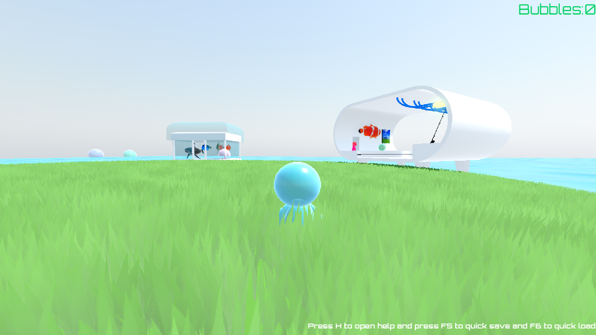
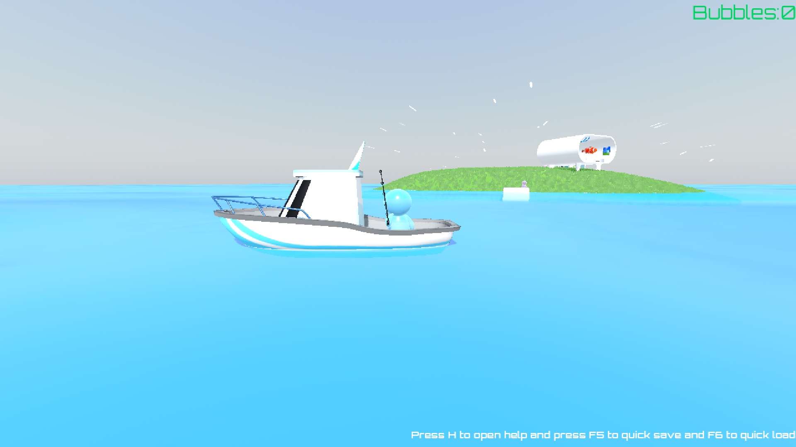
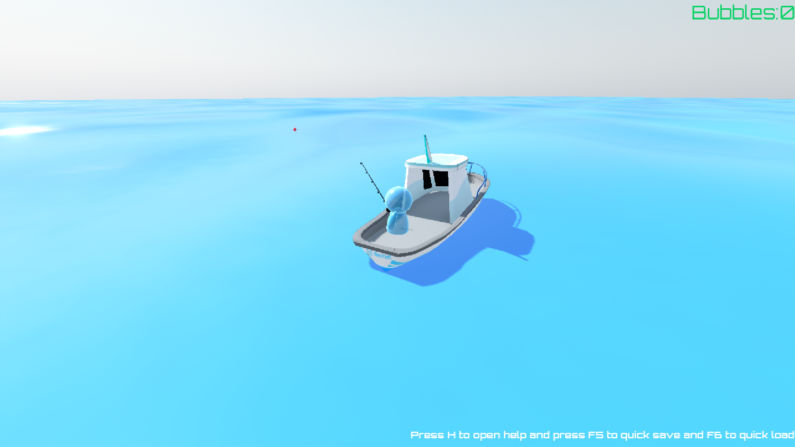
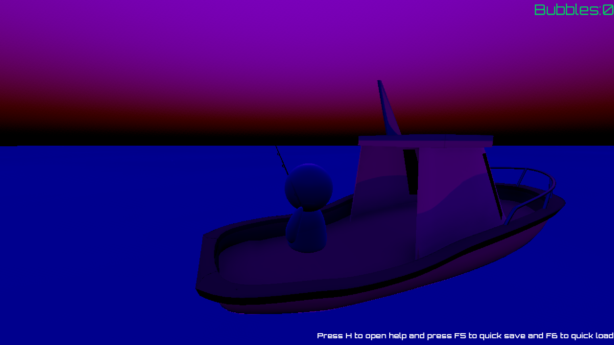

# Fishing in future

> A fishing game set in the future that was promised to us

## About

Have you ever wondered what fishing in era of frutiger aero would look like? Well look no futrher ive started work on one of the best most relaxing fishing games to fill that dream

## Gameplay

A chill relaxing game you start with looking around and admiring the beauty, then you press F to throw the rod and C to mount the boat, You go around catching fishes, the deeper you go the cooler fishes you find, Sell them for upgrades in ur equipment and cosmetcis (coming soon)

## Built With

* Godot engine
* Blender
* Gimp
(ONLY open source stack)

## Installation

Just double click the executable file for your OS and ur good to go

## Development Status

**Status:** In Development

Currently made saving possible, refined the fishing mechanic, implemented daylight cycle, Added selling in shop and talking to NPCs, Ride around the baot and have fun, implemented quiet beautiful grass, Added NPCs and interactions, And added saving/loading

## Roadmap

Check TodoFile.txt
